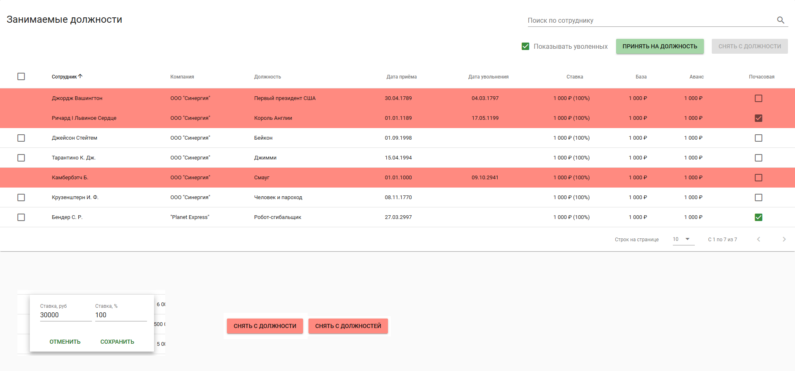

Фронтенд-часть:
==============

Задание
-------

Требуется разработать SPA с использованием фреймворка `vue.js` (можно
`nuxt.js`).

Для создания окружения нужен Node.js (достаточно LTS версии). Использовать
компоненты Vuetify вместе с Webpack.

Немного доков:

* https://vuejs.org/v2/guide/index.html
* https://vuetifyjs.com/vuetify/quick-start

О задаче
--------

Создать компонент для отображения должностей (внешний вид ниже).

О поведении:

* отображение с множественным выбором, пагинацией и сортировкой по всем
колонкам. В столбце `Ставка` отображаются два значения - `salary` в рублях и
`fraction` в процентах

* строки с уволенными сотрудниками (с `fireDate != null`) должны быть помечены 
красным

* при вводе текста в строку поиска вывод должен фильтроваться по имени
сотрудника

* поля `Ставка`, `База`, `Аванс` и `Почасовая` - редактируются по нажатию на
них, пример встроенного редактирования внизу слева на картинке (для колонки
`Ставка` надо изменять и рублевую часть и процентную, для остальных полей
достаточно одного поля ввода, галочка `Почасовая` должна реагировать на клик
без диалога)

* при снятой галочке `Показывать уволенных` не должно быть видно сотрудников с
`fireDate !== null`

* на строках для уволенных сотрудников отсутствует возможность выбрать строку
(чекбокс слева), а так же нельзя редактировать поля `Ставка`, `База`, `Аванс`
и `Почасовая`

* при выборе одной либо нескольких строк кнопка `Снять с должности` (справа
вверху) должна становиться активной и, в зависимости от количества выбранных
строк, должна изменять надпись с "... должности" на "... должностей" (показано
внизу на рисунке)

Кнопки, таблица и поля ввода - стандартные из компонентов Vuetify, пример по
встроенному редактору данных в строке там тоже есть.

Описанный функционал поведения элементов должен быть реализован полностью.

Пиксель в пиксель повторять не нужно, примерного расположения и выравнивания
компонентов вполне достаточно.

